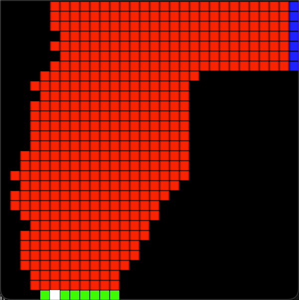
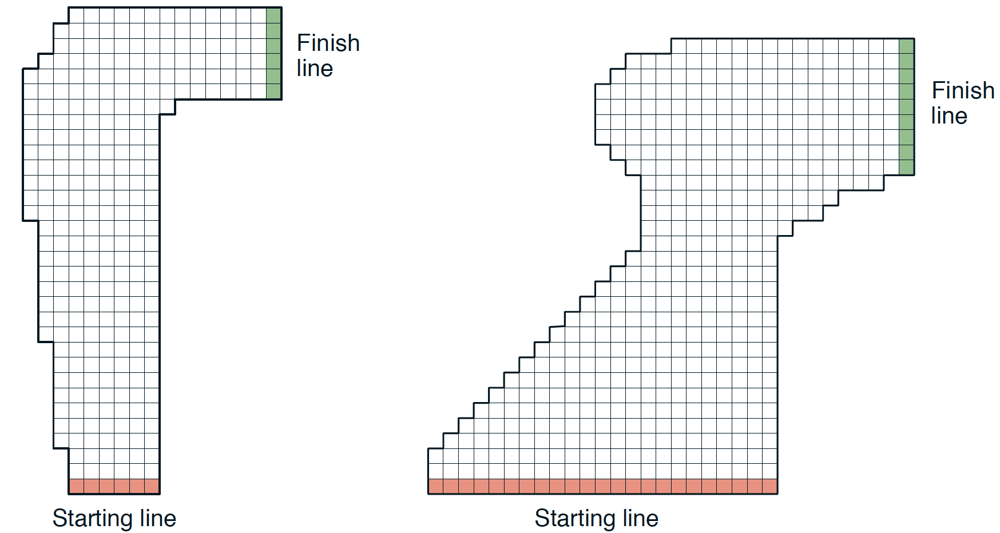
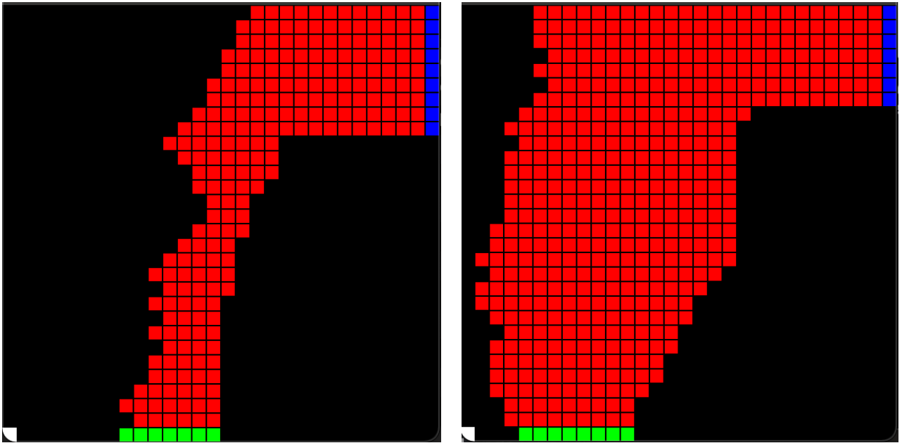
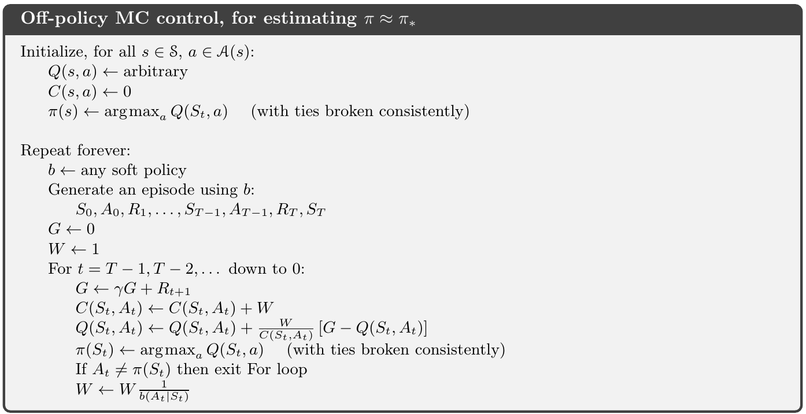

# Sutton's Autonomous Racetrack with Off-policy Monte-Carlo control



This is a simple attempt to solve the race track problem in Sutton's book, using Off-policy Monte-Carlo control method.

This solution was written in C++ as main language, on Xcode 12.X platform. Visualization of race track requires installation of the SFML packages.
Unit testings were carried out using XCTest as well. All modules have tests except the visualization module, which cannot be supported by XCTest.

## Problem Statement:
Consider driving a race car in racetracks like those shown in the following figure from the book. You want to go as fast as possible, but not so fast as to run off the track. In our simplified racetrack, the car is at one of a discrete set of grid positions, the cells in the diagram. The velocity is also discrete, a number of grid cells moved horizontally and vertically per time step.



The actions are increments to the velocity components. Each may be changed by +1, −1, or 0 in one step, for a total of nine actions. Both velocity components are restricted to be nonnegative and less than 5, and they cannot both be zero except at the starting line. Each episode begins in one of the randomly selected start states with both velocity components zero and ends when the car crosses the finish line. The reward are -1 for each step until the car crosses the finish line. If the car hits the track boundary, it is moved back to a random position on the starting line, both velocity components are reduced to zero, and the episode continues. Before updating the car's location at each time step, check to see if the projected path of the car intersects the track boundary. If it intersects the finish line, the episode ends; if it intersects anywhere else, the car is considered to have hit the track boundary and is sent back to the starting line.

Apply a Monte Carlo control method to this task to compute the optimal policy from each starting state.

## Solution Overview:
The problem mimics a over-simplified model of an autonomous race car driving on race track. Since there's no straightforward analytical model of the entire race track environment (the number of combinations of states can be astronimical), the use of Monte Carlo control seems a good option.

We choose to use Off-Policy Monte Carlo control for this problem. The reason we do so is that we prefer a deterministic (greedy) target policy after training (General Policy Iterations), since we're driving a race car and wouldn't want much randomness in our policy. Off-Policy control enables us to do that through using a different, behaivor policy during the GPI training process. 

The advantage of Off-Policy control is that behavior policy, which could even change in between or during episodes, can continue exploring action options while target policy converges to an optimal policy. The disadvantage is that the training can be slow compared to on-policy control, due to the nature of behavior policy exploration and importance sampling required. The consequence is that our model will mostly learn from the tails of training episodes.

We'll encounter both of these advantage and disadvantage during our solution process.

## Essential Modules
We start tackling our problem by first preparing all the modules essential to our Monte Carlo reinforcement learning problem: the environment (race track and response), the state-action space and policies, Monte Carlo episode generators, and the visualizer of the race track.

### The race track environment
We study square race tracks without loosing generality. A race track has its starting line on the bottom of the square board, gradually steers towards right with some random walk. Once past a certain point (row), the track has a high chance of going straight right, and ends on the finish line on the right boarder of the square board.

Sample visualizations of some viable race tracks can be as following:


The race track is generated through a dedicated class, TrackData:
```cpp
using vector_2D = std::vector<std::vector<int>>;

/// Class that generates and stores race track
class TrackData
{
private:
    // Edge length of square-shaped race track
    const int trackSize;
    // 2D vector of race track
    vector_2D raceTrack;
public:
    /// TrackData class constructor
    /// @param trackSizeInput How many squares do you want the race track edge to be? Default is 30.
    TrackData(int trackSizeInput = 30);
    /// Returns track edge size
    int getTrackSize() const;
    /// Returns race track as a 2D vector constant reference
    const vector_2D& getRaceTrack() const;
private:
    /// Generate the race track according to author-defined rules
    void generateRaceTrack();
};
```

We then construct an environment, TrackEnv. The environment transitions a given state-action pair to the next state, while also giving feedback on the reward (-1) and whether the finish line is crossed. As per the problem statement, if car races out of track, it will be reset to a random starting line position unless the finishe line is crossed.

```cpp
using state_tuple = std::tuple<int, int, int, int>;
/// Struct storing env response including reward, next state, and whether the finish line has been crossed
struct envResponse
{
    // Reward to the step
    int reward;
    // The next state(four-) tuple
    state_tuple nextState;
    // Whether the finish line is crossed at this step
    bool finished;
};
/// Class that simulates the track environment
class TrackEnv
{
private:
    int trackSize;
    // A constant reference to given race track
    const vector_2D& raceTrack;
    // Easy access to starting line positions
    std::vector<std::tuple<int, int>> startLine;
    // Easy access to finish line positions
    std::vector<std::tuple<int, int>> finishLine;
public:
    /// Construct track parameters based on input TrackData
    /// @param inputTrack Input TrackData class instance
    TrackEnv(const TrackData& inputTrack);
    /// Returns a random starting state as state (4-) tuple
    state_tuple getStartState() const;
    /// Given current state and action (acceleration), return the next environment response struct
    /// @param currState Current state tuple
    /// @param acceleration Chosen action
    envResponse getEnvResponse(state_tuple currState, std::tuple<int, int> acceleration) const;
};
```

### The racing policy
The policy class, TrackPolicy, is the core module of our reinforcement learning story. It records all state-action pairs visited, their current state-action value, importance-sampling weight. It then derives the behavior and target control policies from these data. 

```cpp
std::vector<std::tuple<int, int>> actionSpace(state_tuple carState);

/// Class that stores state action (Q-) values, makes and modifies target and behavior policies
class TrackPolicy
{
private:
    // Stores the state-action space
    std::map<state_tuple, std::vector<std::tuple<int, int>>> stateActionSpace;
    // Stores the state-action cumulative weight
    std::map<state_tuple, std::vector<double>> stateActionWeight;
    // Stores the state-action value
    std::map<state_tuple, std::vector<double>> stateActionValue;
    // Stores the state-action count of visits
    std::map<state_tuple, int> stateVisitCount;
    // Soft parameter for the behavior policy
    double epsilonSoft;
    // Threshold for soft behavior policy to become greedy
    int stateVisitThreshold;
```

Since Off-Policy controls can have great degree of freedom in customizing the behaivor policy, our policy module also records state visit counts, setter and getter of epsilon-soft parameter, etc... to enable versatile customization of the behavior policy as long as state-action coverage is ensured.

```cpp
public:
    /// Constructor for the TrackPolicy class
    /// @param epsilonInput Initial value for the behavior policy epsilon soft parameter. Default is 1.0, a uniformly random policy.
    /// @param stateVisitThreshInput How many visits to a state before starting to converge behavior policy to target policy
    TrackPolicy(double epsilonInput = 1.0, int stateVisitThreshInput = 100);
    /// Updates the state-action (Q-) value according to new observed values. Returns void type.
    /// @param carState Car state to be updated
    /// @param acc Action (Acceleration) to be updated
    /// @param newReturn G, the new return value to be updated
    /// @param newWeight W, the new sampling weight to be updated
    void updateStateActionVal(state_tuple carState, std::tuple<int, int> acc, double newReturn, double newWeight);
    /// Returns the current state-aciton value.
    /// @param carState Car state to be inquired
    /// @param acc Action (Acceleration) to be inquired
    double getStateActionVal(state_tuple carState, std::tuple<int, int> acc) const;
    /// Sets the epsilon soft parameter of the behavior state
    /// @param epsilon Epsilon soft parameter
    void setBehaveEpsilon(double epsilon);
    /// Returns the current epsilon soft parameter of the behavior policy
    double getBehaveEpsilon() const;
    /// Returns the action and probability (importance sampling) under behavior policy for a specific state
    /// @param carState Car state to be inquired
    std::tuple<int, int> getBehavePolicy(state_tuple carState) const;
    /// Get the probability of getting such action from behavior policy for importance sampling
    /// @param carState Car state inquired
    /// @param acc Action inquired
    double getBehaveProb(state_tuple carState, std::tuple<int, int> acc) const;
```

_**One important caveat**_ lies in the target policy. Since the soft behavior policy-generated training episode variations is astronimical, and our model mostly learns from the tails of episodes, not all states can be visited given a reasonable training time, especially for states close to the starting line.

Under such situation, if target policy deterministically returns an action based on initial values or incomplete state-action values, an episode generated using target policy can often result in extremely long episodes (close to infinite loops), which is far from what we'd like to see.

For this reason, when an incompletely trained state is inquired for target policy, we return a random policy instead of a deterministic policy. This choice can quite effectively avoid the generation of long episodes.

```cpp
public:
    /// Returns the action under the current target policy for a specific state
    /// @param carState Car state to be inquired
    std::tuple<int, int> getTargetPolicy(state_tuple carState) const;
private:
    /// Get a random viable policy based on the car state
    /// @param carState Car state inquired
    std::tuple<int, int> getRandomPolicy(state_tuple carState) const;
};
```

### The race track visualizer
We create our race track visualization module, TrackVisualizer, using the well-known SFML library for C++. It takes in the race track module, TrackData, and draws track grid, startling line, finish line as red, green, and blue squares, respectively. 

```cpp
/// Class that creates a window to visualize race track and car movement
class TrackVisualizer
{
private:
    int trackSize;
    // A constant reference to given race track
    const vector_2D& raceTrack;
    // Container of a SFML window
    sf::RenderWindow trackWindow;
    // Pixel size of a single grid
    float gridPixel;
public:
    /// TrackVisualizer constructor
    /// @param inputTrack Input TrackData class instance.
    TrackVisualizer(const TrackData& inputTrack);
private:
    /// Starts a race track window
    void startWindow();
    
    /// Draw race track grid to window
    void drawTrackGrid();
    
    /// Draws the current position of car
    /// @param carState tuple representing the current state of car
    void drawCarState(state_tuple carState);
};
```

The visualizer can also take in an entire episode, and plot the race car on track as white square.

```cpp
public:
    /// Draws the race track given a car trajectory
    /// @param carEpisode A full trajectory of car episode
    void drawRaceTrack(std::vector<state_action_reward_prob> carEpisode);
```

## Off-Policy Monte Carlo control


