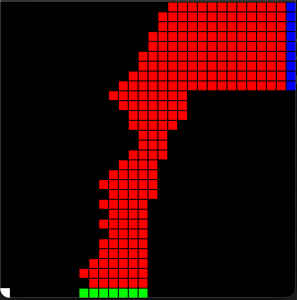

# Sutton's Autonomous Racetrack with Off-policy Monte-Carlo control

This is a simple attempt to solve the race track problem in Sutton's book, using Off-policy Monte-Carlo control method.

This solution was written in C++ as main language, on Xcode 12.X platform. Visualization of race track requires installation of the SFML packages.
Unit testings were carried out using XCTest as well. All modules have tests except the visualization module, which cannot be supported by XCTest.

## Problem Statement:
Consider driving a race car in racetracks like those shown in the following figure from the book. You want to go as fast as possible, but not so fast as to run off the track. In our simplified racetrack, the car is at one of a discrete set of grid positions, the cells in the diagram. The velocity is also discrete, a number of grid cells moved horizontally and vertically per time step.

The actions are increments to the velocity components. Each may be changed by +1, −1, or 0 in one step, for a total of nine actions. Both velocity components are restricted to be nonnegative and less than 5, and they cannot both be zero except at the starting line. Each episode begins in one of the randomly selected start states with both velocity components zero and ends when the car crosses the finish line. The reward are -1 for each step until the car crosses the finish line. If the car hits the track boundary, it is moved back to a random position on the starting line, both velocity components are reduced to zero, and the episode continues. Before updating the car's location at each time step, check to see if the projected path of the car intersects the track boundary. If it intersects the finish line, the episode ends; if it intersects anywhere else, the car is considered to have hit the track boundary and is sent back to the starting line.

Apply a Monte Carlo control method to this task to compute the optimal policy from each starting state.

## Solution Overview:
The problem mimics a over-simplified model of an autonomous race car driving on race track. Since there's no straightforward analytical model of the entire race track environment (the number of combinations of states can be astronimical), the use of Monte Carlo control seems a good option.

A sample visualization of a race track can be as following:

or the following:

